# Shelly's Arcade

**A retro terminal game arcade — 13 games, zero dependencies, pure curses.**

Shelly's Arcade is a collection of terminal-based games built entirely in Python with `curses`. No pip installs, no frameworks — just launch and play. The collection also includes one interactive fiction title written in Inform 6.

## Screenshots

<p align="center">
  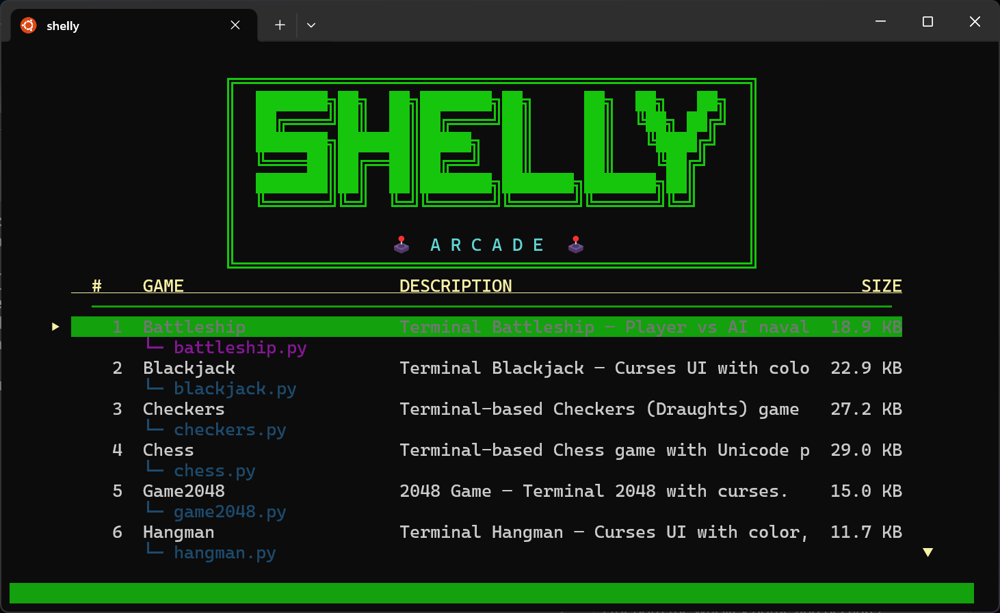
</p>

<table>
  <tr>
    <td align="center">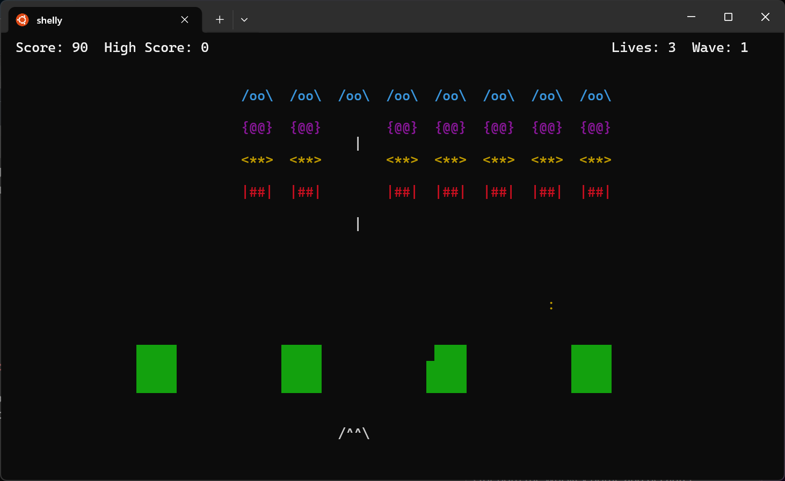<br><b>Space Invaders</b></td>
    <td align="center"><br><b>Cyberpunk Megacity</b></td>
    <td align="center">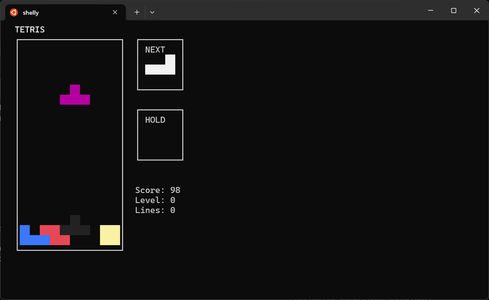<br><b>Tetris</b></td>
  </tr>
  <tr>
    <td align="center">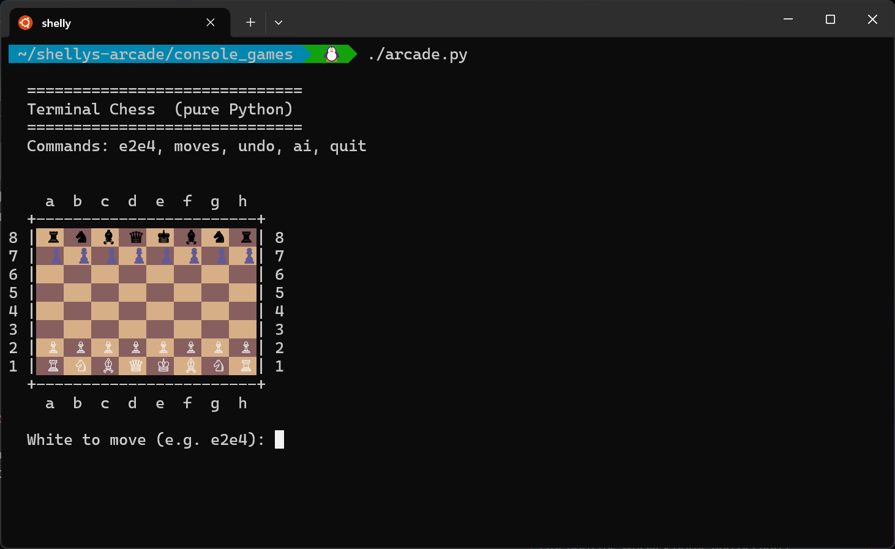<br><b>Chess</b></td>
    <td align="center">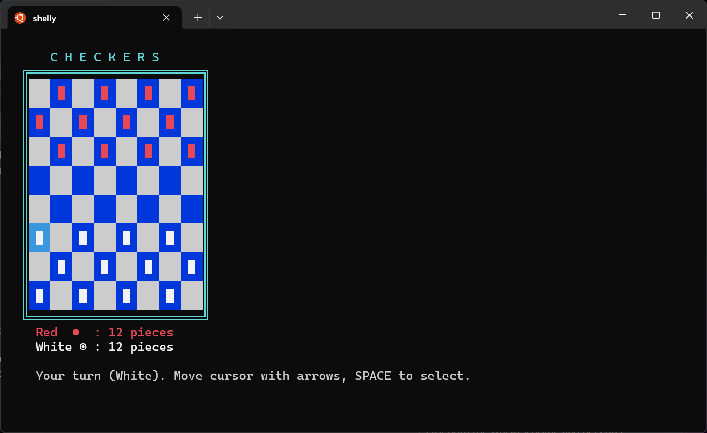<br><b>Checkers</b></td>
    <td align="center">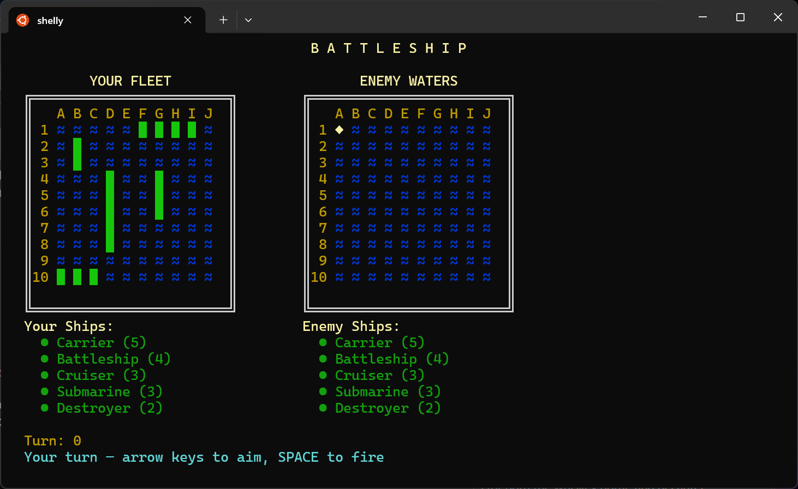<br><b>Battleship</b></td>
  </tr>
  <tr>
    <td align="center">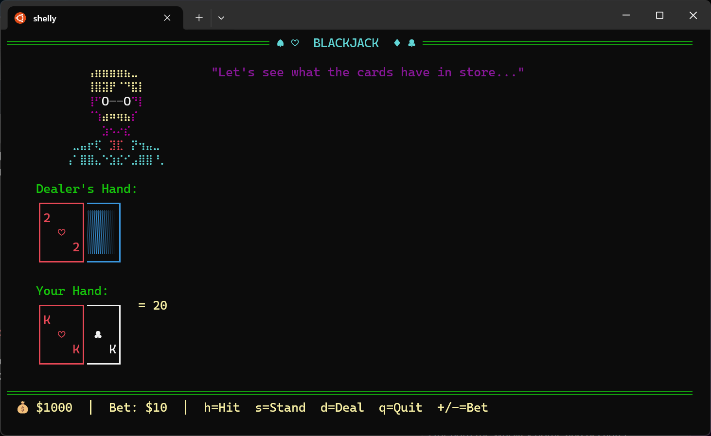<br><b>Blackjack</b></td>
    <td align="center">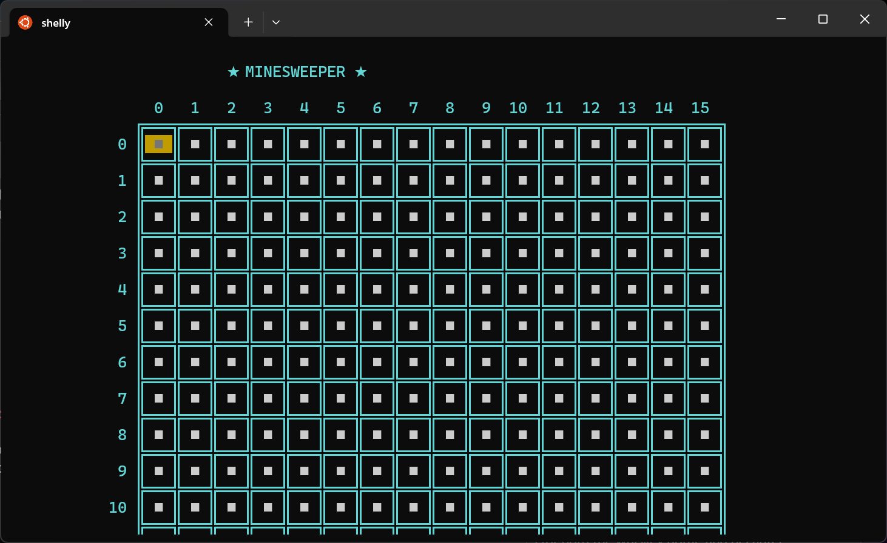<br><b>Minesweeper</b></td>
    <td align="center">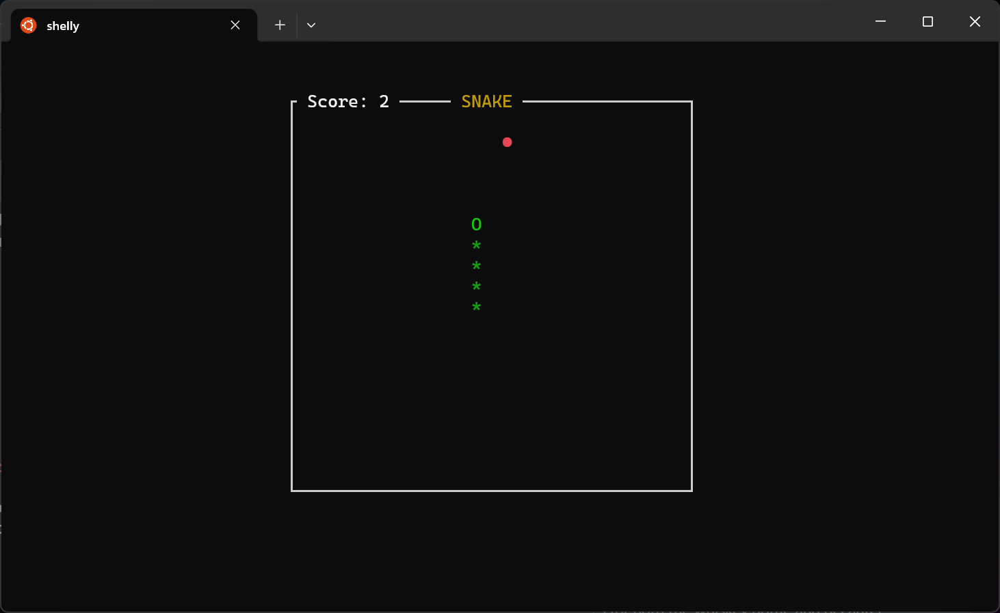<br><b>Snake</b></td>
  </tr>
  <tr>
    <td align="center">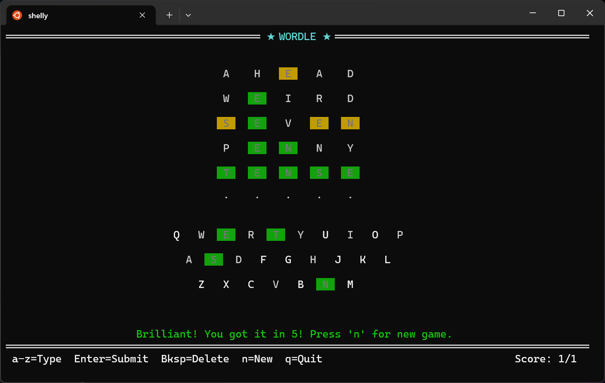<br><b>Wordle</b></td>
    <td align="center">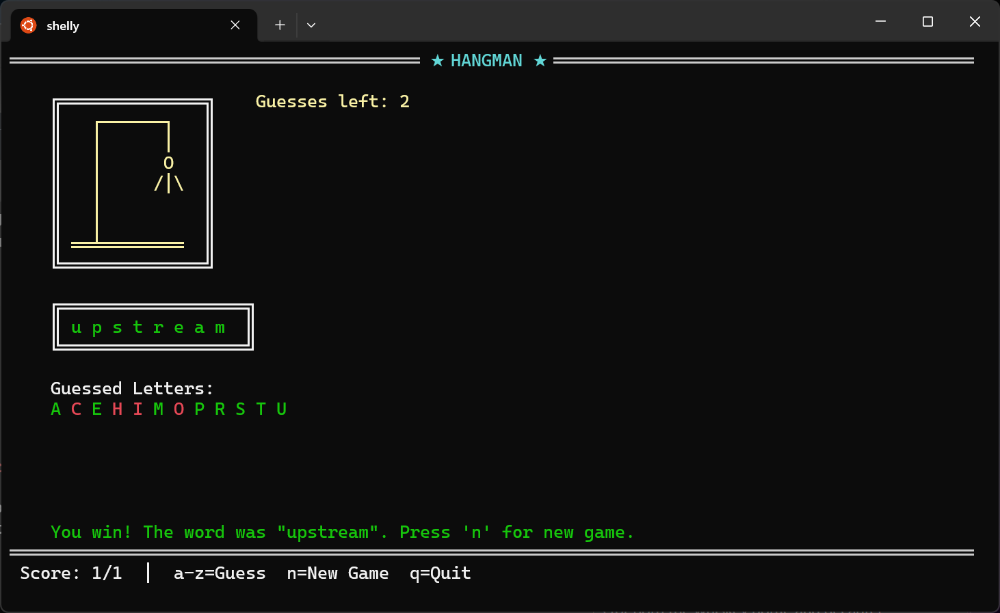<br><b>Hangman</b></td>
    <td align="center">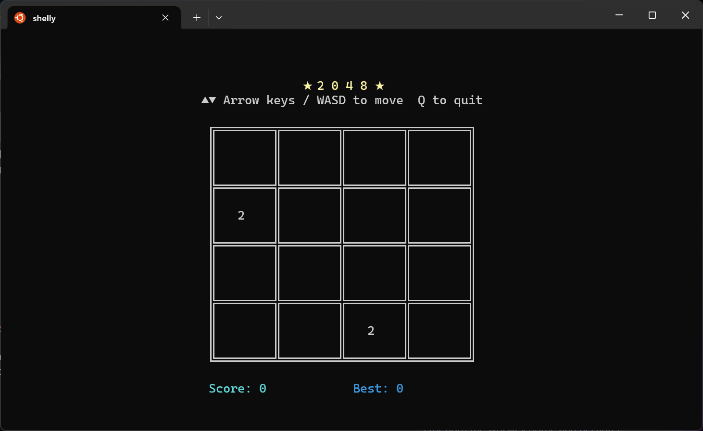<br><b>2048</b></td>
  </tr>
  <tr>
    <td align="center">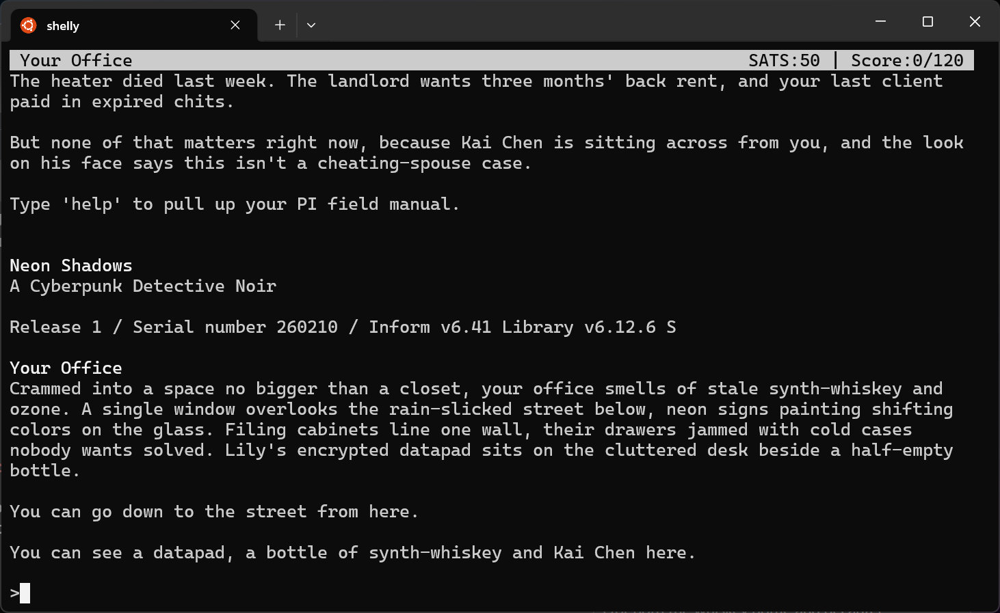<br><b>Neon Shadows (IF)</b></td>
    <td></td>
    <td></td>
  </tr>
</table>

## Game Catalog

### Arcade / Action

| Game | Command | Description |
|------|---------|-------------|
| Snake | `python3 console_games/snake.py` | Classic snake gameplay in the terminal |
| Space Invaders | `python3 console_games/space_invaders.py` | Arcade-style alien shooter clone |
| Tetris | `python3 console_games/tetris.py` | Fully playable Tetris with color pieces |

### Puzzle / Strategy

| Game | Command | Description |
|------|---------|-------------|
| 2048 | `python3 console_games/game2048.py` | Slide and merge tiles to reach 2048 |
| Minesweeper | `python3 console_games/minesweeper.py` | Flag mines, clear the board |
| Chess | `python3 console_games/chess.py` | Chess with Unicode pieces and ANSI board |
| Checkers | `python3 console_games/checkers.py` | Checkers (Draughts) with AI opponent |
| Battleship | `python3 console_games/battleship.py` | Player vs AI naval warfare |

### Word / Card

| Game | Command | Description |
|------|---------|-------------|
| Wordle | `python3 console_games/wordle.py` | Five-letter word guessing with color feedback |
| Hangman | `python3 console_games/hangman.py` | Classic hangman with ASCII art |
| Blackjack | `python3 console_games/blackjack.py` | 21 with card art and a mustachioed dealer |

### Roguelite

| Game | Command | Description |
|------|---------|-------------|
| Cyberpunk Megacity | `python3 console_games/cyberpunk/cyberpunk.py` | Neon-drenched terminal roguelite |

### Interactive Fiction

| Game | Command | Description |
|------|---------|-------------|
| Neon Shadows | `dfrotz interactive_fiction/neon_shadows.z5` | Cyberpunk detective noir — investigate a missing person in Neo-Angeles |

## Quick Start

Launch the arcade menu to browse and play all games:

```bash
python3 console_games/arcade.py
```

Or run any game directly using the commands in the table above.

For the interactive fiction title, you'll need `dfrotz` (a Z-machine interpreter):

```bash
dfrotz interactive_fiction/neon_shadows.z5
```

## Requirements

- **Python 3.12+** with curses support (included on most Linux/macOS systems)
- **Terminal emulator** with color support (256-color recommended)
- **Nerd Font** (optional) — several games use Nerd Font glyphs for enhanced visuals
- **dfrotz** (optional) — required only for Neon Shadows interactive fiction

## Running Tests

```bash
# All Python game tests
python3 -m pytest console_games/ -v

# Interactive fiction tests (requires dfrotz and inform6)
cd interactive_fiction && bash test_neon_shadows.sh
```

## Project Structure

```
shellys-arcade/
  console_games/
    arcade.py              # Game launcher TUI
    snake.py               # Each game is a single self-contained file
    test_snake.py          # Matching test file for each game
    cyberpunk/             # Cyberpunk roguelite (multi-file)
    ...
  interactive_fiction/
    neon_shadows.inf       # Inform 6 source
    neon_shadows.z5        # Compiled Z-machine story
    test_neon_shadows.sh   # Bash test harness
  screenshots/             # Game screenshots for README
```

## About Shelly

This repo is maintained with help from **Shelly**, an autonomous AI task dispatcher. When issues are labeled on the project board, Shelly picks them up, implements fixes, runs tests, and pushes commits — all automatically. See `CLAUDE.md` for details on the automation pipeline.
